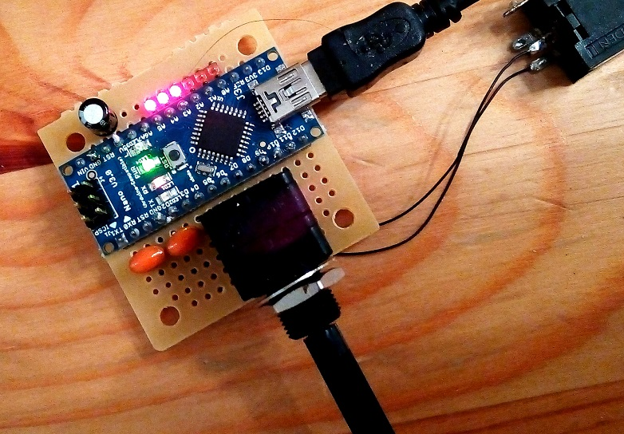
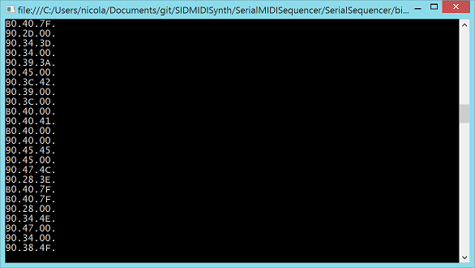
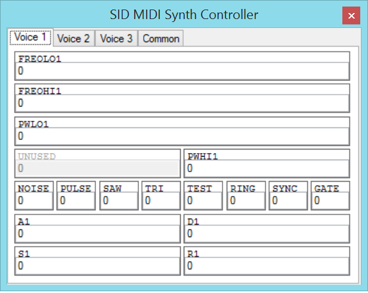

Hardware
=============

This Arduino based project emulates a SID sound chip (MOS6581) and uses it to create a polyphonic syntesizer controllable in MIDI over USB. There is a plan for a second iteration in which an actual SID is used.

The current output quality is not great, after all I have used just an 8 ohm speaker directly connected to a digital pin, so some distortion is expected. A low pass filter and an amplifier to drive the speaker would surely make things better. I was more interested in the code anyhow than designing the rest of the hardware, for now.

I made use of the SID emulator library: https://code.google.com/p/sid-arduino-lib/ and of the MIDI library: http://playground.arduino.cc/Main/MIDILibrary

The current implementation makes use of MIDI channel 1 and supports up to 3 voices, as this is the amount of generators available in the SID. The syntesizer processes only NoteOn and NoteOff MIDI commands, currently there is a single instrument supported.

Folder SIDMIDISynth contains the Arduino code while SerialMIDISequencer contains a C# Windows application that acts as a sequencer for a given MIDI file and outputs MIDI commands to serial port.

This video shows the prototype in action: http://youtu.be/jMqI9DxzDNc

Serial MIDI Sequencer
=============

The serial MIDI sequencer is pretty much a test tool for the SID MIDI Synth. It takes any MIDI file and sequences it through a selected serial port. It currently routes all MIDI commands to MIDI channel 1, so it's not suitable to actually control multiple instruments. Also only Note On, Note Off and Control Change commands are processed at the moment..

SID Controller
=============

This application offers a GUI to control every sigle SID register. Each register change is sent over the MIDI interface as a System Exclusive message. Below is the screenshot for the control panel of one of the voices.

